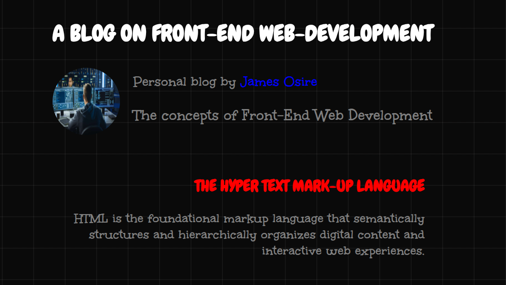
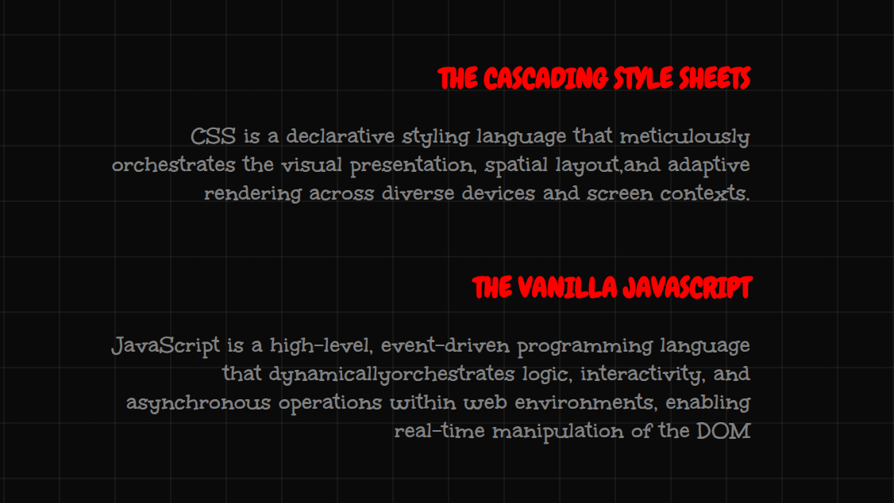

#  Front-End Web Development Blog

A React-based blog application that demonstrates core React concepts including component architecture, props, state management, and unit testing.

---

## Overview

This project is a simple blog application built with React and Vite. It showcases how to break a UI into reusable components, pass data between them using props, manage state with `useState`, and verify rendering behaviour with unit tests.

---

##  Features

- Dynamic blog title managed via `useState`
- Reusable `Article` components rendered from a posts array
- Props-driven architecture — data flows from parent to child
- Floating label input UI pattern
- Unit tested with Vitest and React Testing Library

---

##  Project Structure

    src/
    ├── assets/               # Images and static assets
    ├── App.jsx               # Root component — holds state and posts data
    ├── Header.jsx            # Displays the blog title via props
    ├── ArticleList.jsx       # Receives posts array and renders Article components
    ├── Article.jsx           # Displays individual post title and body
    ├── App.test.jsx          # Unit tests for all components
    ├── setup.js              # Vitest and jest-dom setup
    ├── index.css             # Global styles
    └── main.jsx              # React DOM entry point

---

---

##  Screenshots

### First screenshot


### Second Screenshot


---

##  Technologies Used

| Technology | Purpose |
|---|---|
| React 18 | UI component library |
| Vite | Build tool and development server |
| Vitest | Unit test runner |
| React Testing Library | Component rendering and querying in tests |
| jest-dom | Custom DOM matchers for assertions |
| CSS3 | Styling and layout |

---

##  Getting Started

### Prerequisites
Make sure you have **Node.js** installed on your machine.

### Installation

1. Clone the repository:
```bash
git clone https://github.com/Aucire/Blog-site-with-react.git
```

2. Navigate into the project directory:
```bash
cd Blog-site-with-react
```

3. Install dependencies:
```bash
npm install
```

4. Start the development server:
```bash
npm run dev
```

5. Open your browser and visit:
```bash
http://localhost:5173
```
---

##  Components

### `App.jsx`
- Root component of the application
- Manages `title` state using `useState`
- Holds the `posts` array and passes it down as props

### `Header.jsx`
- Receives `title` as a prop
- Renders the blog heading inside a `<header>` element

### `ArticleList.jsx`
- Receives `posts` array as a prop
- Maps over posts and renders an `Article` component for each one
- Wrapped in a `<main>` element

### `Article.jsx`
- Receives `title` and `body` as props
- Renders individual blog post content inside an `<article>` element

---

##  Testing

This project uses **Vitest** and **React Testing Library** for unit testing.

### Run Tests

```bash
npm test
```

### What is Tested

| Test | Description |
|---|---|
| App renders | Verifies App mounts without crashing |
| Heading prop | Checks title prop renders correctly |
| Heading prop update | Verifies different props render correctly |
| ArticleList count | Confirms correct number of articles rendered |
| ArticleList titles | Checks each post title appears on screen |
| Article props | Verifies title and body props display correctly |

---

##  License

This project is open source and available under the [MIT License](LICENSE).

---

### > Built with using `React`, `Vite` `css` and `html`